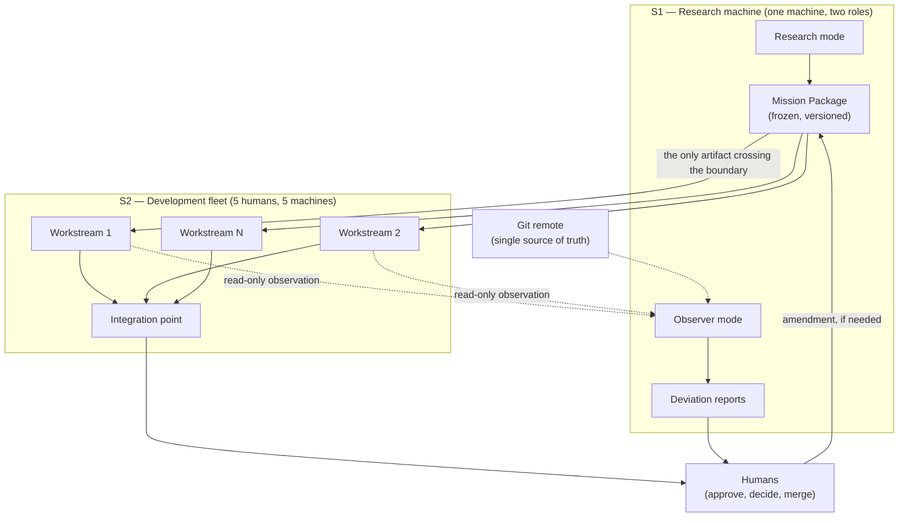

# Architecture Blueprint — Multi-AI Workflow for a Five-Person Cybersecurity Hackathon

**Status:** draft v1, 2026-09-14
**Author:** Tomasz Gonczar (architecture and workflow design)
**Client:** five-person cybersecurity hackathon team, October 2026 event
**Scope:** architecture, discovery translation, and implementation-ready planning only
**Not in scope:** building the team's hackathon solution; operating the systems during the event

---

## 0. One-sentence decision

**Two machines carry three roles.** A single **research machine** decomposes an unknown topic into a frozen, versioned **Mission Package**, and later re-anchors onto the same package as a **read-only observer**. A **five-machine development fleet** writes the solution under a one-writer-per-workspace rule, with Git as the only source of truth and every merge behind a human decision. The observer is **degradable**: under time pressure it is switched off, and the team loses monitoring — never the ability to build.

```text
CORE           S1 Research machine  →  Mission Package (frozen, versioned)
                                        ↓
CORE           S2 Development fleet (5 humans, 5 machines) → solution
                                        ↑
DEGRADABLE     Observer (role on S1) → deviation reports vs. frozen plan → humans
```

---

## 1. The client problem

Five engineers, one unfamiliar cybersecurity topic revealed at event start, a fixed and short duration. The team must research a domain none of them knows, plan a solution, build it, and submit a working demo.

The defining constraint is **not** technical difficulty. It is **simultaneity**: research, planning, and building overlap in a window of hours, across five people who cannot all hold the same context.

### 1.1 The real failure modes

| Failure | What it looks like at hour 12 |
|---|---|
| **Unbrokered research** | Five people each read different sources and form five incompatible mental models of the problem |
| **Plan drift** | The plan agreed at hour 2 no longer describes what is being built at hour 10, and nobody notices |
| **Collision** | Two developers edit the same surface; the merge costs more than the feature |
| **Unverifiable progress** | "It works" is asserted from narration, not from a reproducible check |
| **Single point of failure** | The one machine holding coordination state dies, and the team loses the plan |

### 1.2 What "arming for the unknown" means

Because the topic is unknown, **no domain knowledge can be prepared in advance**. The only thing that can be prepared is *process*. This is the entire design premise:

> The system must be **topic-agnostic**. Its value is structure, not answers.

Any component that assumes a domain has already failed the brief.

---

## 2. Discovery record

Recorded as part of a client-style discovery with the five team members. Intent, not tooling, came first.

### STAKEHOLDER INTENT
Win a cybersecurity hackathon whose topic is unknown at preparation time, without losing hours to coordination overhead.

### SUCCESS CRITERIA
A working demo submitted on time, built against a defensible understanding of the problem, with every team member able to explain what was built and why.

### CONSTRAINTS
- Topic revealed at or near event start; no domain-specific preparation possible.
- Five people, five machines; mixed languages among participants.
- Duration measured in hours, not days; no slack for a second architecture session.
- Whatever is prepared must survive a participant who has never read the blueprint.

### ASSUMPTIONS
- Machines can reach a shared Git remote.
- At least one machine can run a long-lived process.
- Participants can install a CLI or open a browser tool before the event.

### OPEN QUESTIONS
Listed in §10 — these must be closed by the team, not assumed by this blueprint.

### NON-GOALS
Explicitly **not** building: the hackathon solution, a custom distributed runtime, an autonomous merge authority, a semantic GitHub judge, a permanent agent-per-human role ontology, or a second authoritative mirror of the repository.

### RISKS
Three systems for five people in a short window is itself a risk (§8).

### DECISIONS AND OWNERS
Every architectural decision below carries an owner and a reversal condition (§9).

---

## 3. System 1 — Research machine

**Purpose:** convert an unknown topic into a frozen, reviewable **Mission Package**.

### 3.1 Decomposition, not answers

The research machine does not produce "the answer." It produces a **structured problem**: what is being asked, what is known, what is unknown, what is contradictory, and what would count as a solution.

| Stage | Output |
|---|---|
| Topic intake | Raw statement of the challenge, verbatim, with source |
| Decomposition | Explicit sub-questions, each independently researchable |
| Parallel investigation | Per sub-question: findings with provenance |
| Contradiction surfacing | Where sources disagree — recorded, **not resolved by vote** |
| Synthesis | Structured picture: known / unknown / contested |

### 3.2 Non-negotiable rules

1. **Provenance is mandatory.** Every claim carries a source and an access date. A claim without a source is marked `[unverified]` and cannot be built against.
2. **Agreement is not truth.** Several sources or agents agreeing is recorded as agreement, never as verification. This rule exists because the sibling project `dSearch` measured exactly this and **falsified** it: 261 corroborated URLs, only 38 correct — precision 0.1456.
3. **Contradictions are preserved, not merged.** A contradiction is information. Resolving it by averaging destroys the signal.
4. **Topic-agnostic.** No domain-specific component, prompt, or assumption.

### 3.3 The Mission Package — the contract

The research machine must **not** hand prose to five builders. It freezes a package. The package is the only artifact that crosses into development.

| Field | Contents |
|---|---|
| `objective` | One paragraph, falsifiable statement of what must be built |
| `constraints` | Time, required deliverables, prohibited techniques, environment limits |
| `evidence` | Findings with provenance, grouped by sub-question |
| `unknowns` | Explicit list — including which unknowns are blockers vs. tolerable |
| `acceptance_tests` | What demonstrably counts as done, expressed so a machine can check it |
| `interfaces` | Boundaries between the workstreams the fleet will own |
| `dependency_graph` | Which workstream must precede which |
| `task_ownership` | Proposed owner per workstream |
| `integration_order` | The sequence in which pieces are allowed to meet |
| `escalation_rules` | What stops work and summons a human |

**Freeze semantics.** Once the humans approve the package, it is **versioned and immutable**. Any change becomes a numbered **amendment** with a reason and an approver. Silent prompt drift is a defect, not an update.

### 3.4 Degraded modes

| Condition | Behaviour |
|---|---|
| No internet | Serve the last frozen package; research paused and visibly marked |
| Provider outage | Fall back to a second provider or manual browser research |
| Machine loss | Package is in Git — a second machine can adopt the observer role |

**Boundary:** the research machine is a single point of failure only for *new* research. The frozen package is replicated in Git, so its loss never blocks the fleet.

---

## 4. System 2 — Development fleet

**Purpose:** five humans across five machines build the solution without colliding, against the frozen package.

### 4.1 Why the fleet is not a swarm

Five machines is an **operational constraint** (five people have five laptops), not a mandate to run five parallel workstreams. Parallelism is chosen per task from the dependency graph. A task with no independent interface to work against is **not** parallelised.

### 4.2 Ownership model

| Rule | Enforcement |
|---|---|
| **One writer per workspace** | Each workstream gets its own branch/worktree; ownership is recorded in the package |
| **Interfaces are the only meeting point** | Two workstreams may only meet through the interface frozen in the package |
| **No direct work on the integration branch** | Integration happens only at a defined order point |
| **Integration order is explicit** | Written in the package; deviations are amendments |
| **Humans own merge** | No AI merges. Ever |

### 4.3 Model and capability selection

Selection is **per task**, not per person. A role is not a permanent identity — it is a bundle of capability chosen for one task from the dependency graph. This deliberately avoids the "five agents, one per human" ontology that ages badly the moment a task changes shape.

### 4.4 Escalation

Work stops and summons a human when: an interface in the package is found wrong; an acceptance test cannot be satisfied; two workstreams need the same surface; or the plan and reality have diverged beyond the current amendment.

### 4.5 Failure recovery

| Failure | Recovery |
|---|---|
| Machine disconnects | Its branch is already pushed; work is reassignable from Git state |
| Machine lost permanently | Package + branches describe exactly what remains |
| Conflicting writes | Ownership rule should have prevented it; the observer reports it if it happens |
| Coordination unavailable | Package is local-readable; fleet continues in independent mode |

### 4.6 The honest limitation

Coordination overhead is **charged against the same clock** as building. Every mechanism in this design must justify its cost in a rehearsal. Anything that cannot is cut.

---

## 5. System 3 — Observer (degradable)

**Purpose:** compare **actual progress** against the **frozen plan**, and answer "where are we now?" on demand.

### 5.1 Why it is a role, not a system

Because the observer's baseline is the Mission Package, and the Mission Package lives on the research machine, the observer belongs there. Running it as a separate service would mean transferring the baseline across a boundary — introducing a class of "the observer has a different version of the plan" bugs for no benefit.

**Consequence:** no additional machine, no additional service, no additional failure domain.

### 5.2 Two concurrent modes on S1

The research machine runs two modes **side by side**, not as a switch:

| Mode | Trigger | Purpose |
|---|---|---|
| `research` | On demand | Answer new sub-questions that arise mid-event |
| `observe` | Continuous | Watch Git/GitHub and report deviation vs. the frozen package |

Research does not stop when building starts. A switch would silently remove the team's ability to investigate an unfamiliar domain at hour 8 — precisely when they need it most.

### 5.3 What the observer watches

Repository state, pull requests, CI runs, review state, merge conflicts, changes to protected or frozen surfaces, and stalls (no movement within a stipulated window).

### 5.4 Read-only, without exception

| Permission | Granted |
|---|---|
| Read repository state, PRs, CI results | ✅ |
| Post alerts to the team channel | ✅ |
| Comment on PRs | ✅ (advisory only) |
| Commit, push, merge, approve, or change protection | ❌ never |

The observer **reports facts and risks**. It does not judge semantic correctness and does not merge. This rule must be enforced by credentials, not by instruction — see §7.

### 5.5 Reporting discipline

- **Facts, not opinions.** "Lane 3 has not moved in 4 hours; the plan allotted 2" — not "Lane 3 is behind schedule."
- **No defending its own plan.** The same machine authored the package and now measures against it. It must report deviation, never rationalise the plan. This is a real risk (§8) with a designed mitigation: the observer's output schema has no field for assessment, only for observation.
- **Deviation is relative to a version.** Every report names the package version it measured against.

### 5.6 Noise control

An observer that alerts constantly is switched off within an hour — the failure mode that kills monitoring systems. Alerts are bounded: only deviation from the plan, CI failures, conflicts, and stalls. Everything else is available on request, not pushed.

### 5.7 Degradation

**The observer is tier 2.** Under time pressure it is switched off and the team loses monitoring, not capability. This is stated in the blueprint because the alternative — a design where monitoring is load-bearing — would collapse at exactly the moment it is needed.

---

## 6. Data flow



**Normal flow** solid; **observation and escalation** dotted.

---

## 7. Authority and security boundaries

| Subject | Owner | Boundary |
|---|---|---|
| Mission Package content | Research machine | Humans approve; AI does not authorise its own scope |
| Scope changes | Humans | Only via numbered amendment |
| Code authorship | Individual developer | One writer per workspace |
| Merge | **Human** | No AI merge authority, ever |
| Repository truth | Git remote | No second authoritative database |
| Check evidence | Reproducible command | A green exit code that scanned nothing is not evidence |
| Observer permissions | Read-only credentials | Enforced by token scope, not by instruction |
| Credentials | Per person, least privilege | Never in the repository, never in prompts |

**The enforcement principle, learned from the sibling rehearsal:** an instruction in a prompt is not a control. In `27_ORCA_VERTICAL_SLICE_REHEARSAL`, a reviewer was *instructed* read-only and no mechanism made mutation impossible. The correction was to narrow the claim — not to pretend the instruction was enforcement.

Applied here: the observer is read-only because its **credential cannot write**. If that cannot be configured, the claim is downgraded and stated as such.

---

## 8. Risks and the scope cut

### 8.1 The honest risk

**Two systems, three roles, and a checklist is already a lot for five people in a short event.** This blueprint deliberately does not add a third service. The table below is the explicit cut order, and it is part of the deliverable, not an admission.

### 8.2 Cut order

| Priority | Component | If cut, what is lost |
|---|---|---|
| **P0 — never cut** | Mission Package + frozen baseline | The fleet builds against nothing |
| **P0 — never cut** | One-writer-per-workspace | Collisions consume the clock |
| **P0 — never cut** | Human merge authority | Unrecoverable integration damage |
| **P1 — cut under pressure** | Observer continuous mode | Loses monitoring; on-demand Git reads remain |
| **P1 — cut under pressure** | Checklist items marked optional | Slower restart; nothing breaks |
| **P2 — cut first** | Parallel workstreams | Slower, but sequential still ships |
| **P2 — cut first** | Automated CI beyond one check | Manual verification, weaker evidence |

### 8.3 The cheerleader risk

The research machine authors the plan and later measures progress against it. A system grading its own homework will rationalise. **Mitigation:** the observer's output schema contains observation fields only — deviation magnitude, timestamp, package version. There is no field in which to argue that the plan is still fine. Assessment belongs to humans alone.

### 8.4 Unvalidated assumptions

No rehearsal has occurred, because the event has not happened. The blueprint therefore makes no claim that any mechanism is *proven*. The rehearsal plan (§9 of the development plan) is the test, and its result is expected to correct this document.

---

## 9. Decisions and reversal conditions

| # | Decision | Why | Reverse if |
|---|---|---|---|
| D1 | Observer is a role on S1, not a separate system | Baseline lives with the plan; one fewer failure domain | Research load saturates S1 during the event |
| D2 | Mission Package is the only cross-boundary artifact | Removes prose drift and version skew | Fleet needs richer context than the package carries |
| D3 | Package is frozen and amended, never silently edited | Makes plan drift visible | Amendments become so frequent the freeze loses meaning |
| D4 | Research and observe run concurrently | Research does not stop at build start | Machine cannot sustain both |
| D5 | One writer per workspace | Collisions cost more than parallelism saves | Workstreams prove genuinely independent |
| D6 | Human owns every merge | Integration damage is unrecoverable under time pressure | Never |
| D7 | Observer read-only by credential | Instruction is not enforcement | Credential scoping unavailable — then state the limit |
| D8 | Topic-agnostic everywhere | The topic is unknown by definition | Never |

### Discarded alternatives

| Alternative | Why rejected |
|---|---|
| Three independent systems | Adds a failure domain and a baseline-transfer bug class for no capability gain |
| Autonomous AI merge | No recovery path under time pressure; destroys the audit trail |
| Semantic GitHub judge | Would place an opaque judgement where auditable evidence is required — the exact error `dSearch` falsified |
| Permanent five-agent-per-human ontology | Ages badly the moment task shapes change |
| Custom distributed runtime | Massive cost, no evidence of need before rehearsal |
| Dashboard for appearance | Cost with no operational consumer |

---

## 10. Open questions — must be closed by the team

These are **not** architectural gaps; they are facts only the team and organizers possess. The architecture is written to survive either answer, and the affected section is named.

| # | Question | Affects |
|---|---|---|
| 1 | One five-person team, or five separate teams? | §4.2 ownership model |
| 2 | Exact dates, duration, and preparation rules? | §8.2 cut order |
| 3 | How is success judged, in the organizers' words? | §3.3 `acceptance_tests` |
| 4 | Machine OS and hardware across the five? | §7 tooling placement |
| 5 | All machines on one network during the event? | §4.5 recovery |
| 6 | Which machine may host long-lived state? | §5.1 observer placement |
| 7 | Which AI accounts, CLIs, and API keys exist per participant? | §4.3 selection |
| 8 | One repository or several? | §4.2 ownership |
| 9 | Are Actions, Apps, webhooks, and branch protection available? | §5.3 observer capability |
| 10 | Who owns final integration and merge? | §7 authority |
| 11 | Is the topic revealed before or at the event? | §3 research runway |
| 12 | Which external services are permitted? | §3.4 degraded modes |
| 13 | What may be captured for the portfolio? | §11 |
| 14 | Who executes this plan after delivery? | Development plan §9 |

---

## 11. Portfolio and privacy boundary

**The claim, stated exactly:**

> I ran client-style discovery with a five-person cybersecurity team facing an unknown topic, and designed an implementation-ready multi-AI workflow: a research machine that freezes an approved Mission Package, a five-machine development fleet under one-writer ownership, and a read-only, degradable observer that measures progress against the frozen plan. Deliverables: architecture blueprint, A–Z development plan, implementation checklist, and a version-controlled diagram.

**Attribution, stated exactly:** I designed the architecture and the workflow. **I did not build, deploy, or test these systems, and I did not participate in the hackathon solution.** The team owns implementation.

**Privacy:** no participant names, no repository contents, no credentials, no sponsor or organizer material, and no topic-specific detail that could disadvantage the team's October event. Any example in the portfolio is synthetic.

**What this demonstrates:** translating an ambiguous, high-pressure external mission into explicit requirements, authority boundaries, failure modes, and a handoff another engineer can execute without a second architecture meeting.

---

## 12. Completion criterion

This blueprint is complete when a senior engineer who has never spoken to the author can answer, without another meeting:

- what starts the system, and on which machine;
- what each human and each AI role may read, write, execute, and approve;
- exactly what crosses from research into development;
- how two developers are prevented from owning the same surface;
- how GitHub is observed without the observer gaining write authority;
- how a failed or disconnected machine is replaced;
- what evidence permits integration, and who decides;
- what the team does when time runs short.
