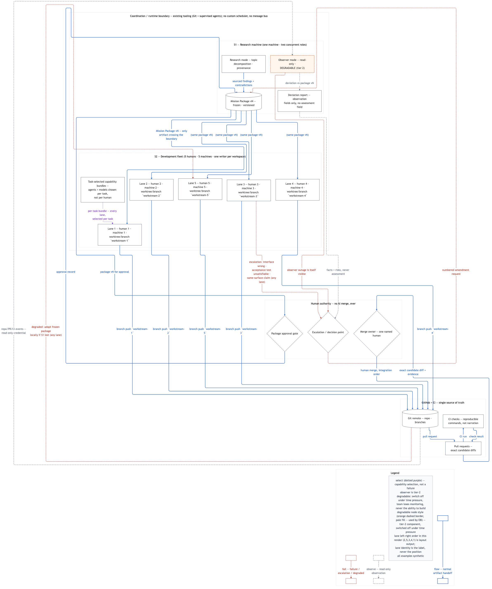

# Hackathon Multi-AI Workflow Blueprint

  <b>The Deterministic AI Systems Suite</b> 
  <a href="https://github.com/TomaszGonczar/dCompress"><b>dCompress</b></a> (Fact Memory) &middot;
  <a href="https://github.com/TomaszGonczar/dsearch"><b>dsearch</b></a> (Retrieval Grounding) &middot;
  <a href="https://github.com/TomaszGonczar/dproof"><b>dproof</b></a> (State Evidence) &middot;
  <a href="https://github.com/TomaszGonczar/omega-zero"><b>omega-zero</b></a> (Governance) &middot;
  <a href="https://github.com/TomaszGonczar/hackathon-multi-ai-blueprint"><b>hackathon-blueprint</b></a> (Operations)

  
  
  
  

**Core design:** Two machine archetypes carry three roles across local laptops. A research machine freezes an approved Mission Package; each developer builds against it in an isolated local repository under single-writer ownership; a read-only observer monitors deviation from the frozen plan. Humans approve the package and own every merge.

**Status:** design complete, unrehearsed. Every mechanism is `DESIGNED` or `DESIGNED+CHECKED`;
nothing is `ENFORCED` — the October event has not happened and no rehearsal has run. Each artifact
states what observation would upgrade each claim.

## What this is

An implementation-ready multi-AI workflow for a team facing a hackathon
whose topic is unknown at preparation time. The package is topic-agnostic by design: its value is
structure, not answers. It covers three systems: single-laptop research, multi-laptop
development, and read-only GitHub observation, plus the checklist and rehearsal documentation to
stand them up without a second architecture session.

## Setup (Local Multi-Laptop)

- **You bring ready:** One laptop with the research AI system pre-installed and tested.
- **Each team member:** Clones this repo + development fleet repo to their own laptop on event day.
- **Network:** All laptops on same Wi-Fi / LAN (no cloud infrastructure required).

## Architecture Diagram

Source of truth: [`06_ARCHITECTURE.mmd`](06_ARCHITECTURE.mmd) (Mermaid, ELK layout; legend
included; normal flow solid blue, observation dashed grey, failure/escalation dashed red,
capability selection dotted purple). Rendered with `-w 2400`; the committed raster is 2384×2855 px (the render command in `06_ARCHITECTURE.mmd` reproduces it).
The embed above is reduced for orientation only; read the diagram at full size:
[PNG](render/06_ARCHITECTURE.png) · [SVG](render/06_ARCHITECTURE.svg).

## Reading order

- **Reviewer, 15 minutes:** [`08_PORTFOLIO_BRIEF.md`](08_PORTFOLIO_BRIEF.md) → the diagram above → [`03_ARCHITECTURE_BLUEPRINT.md`](03_ARCHITECTURE_BLUEPRINT.md) §0/§8/§9 → [`07_FAILURE_AND_REHEARSAL_PLAN.md`](07_FAILURE_AND_REHEARSAL_PLAN.md) validation ledger.
- **Team member, 10 minutes:** README → [`05_IMPLEMENTATION_CHECKLIST.md`](05_IMPLEMENTATION_CHECKLIST.md) quick card (§11) → your slice in `05`.
- **Implementer, full pass:** `03` → `04` → `05` → `07`, with `02` for provenance of each mechanism.

## Documents — two registers, one diagram

**Team register** (imperative, scannable, usable under time pressure):

| File | What it is |
|---|---|
| [`05_IMPLEMENTATION_CHECKLIST.md`](05_IMPLEMENTATION_CHECKLIST.md) | 77 binary, assignable checks across seven time slices (T-7, T-1, event start, per cycle, freeze, submission, teardown) plus an event-day quick card |

**Reviewer register** (narrative, trade-offs, judgment):

| File | What it is |
|---|---|
| [`03_ARCHITECTURE_BLUEPRINT.md`](03_ARCHITECTURE_BLUEPRINT.md) | Source-of-truth architecture: discovery record, three systems, authority and security boundaries, cut order, decisions D1–D8 with reversal conditions, discarded alternatives |
| [`04_DEVELOPMENT_PLAN.md`](04_DEVELOPMENT_PLAN.md) | A–Z plan: phases P0–P9, ownership, observable acceptance per task, failure matrix, acceptance matrix |
| [`02_REUSE_LEDGER.md`](02_REUSE_LEDGER.md) | Every candidate from prior work classified REUSE / ADAPT / REFERENCE ONLY / DROP against a ten-field record, with what was actually proved |
| [`07_FAILURE_AND_REHEARSAL_PLAN.md`](07_FAILURE_AND_REHEARSAL_PLAN.md) | Validation ledger, three-state control table, premortem, catch ledger, decision log with missing-data entries, rehearsal drills |
| [`08_PORTFOLIO_BRIEF.md`](08_PORTFOLIO_BRIEF.md) | Fifteen-minute case study: problem → decisions → evidence → limitations |

**Shared records** (both readers):

- [`HISTORY.md`](HISTORY.md) — the commit sequence, so the provenance lines in the artifacts resolve in a copy without git history.
- [`09_REVIEW_RECORD.md`](09_REVIEW_RECORD.md) — every review finding with its location and disposition, and the mechanical census results: the evidence behind the claim that review happened and defects were fixed.
- [`00_DELIVERABLE_CONTRACT.md`](00_DELIVERABLE_CONTRACT.md) — the frozen interfaces this package was authored against: system invariants, house style, the diagram node and edge IDs every artifact cites, the file-ownership map, and the two recorded diagram fallbacks. Read it to see why the artifacts agree with each other and with the diagram.
- [`01_DISCOVERY_CLOSURE.md`](01_DISCOVERY_CLOSURE.md) — every question the architecture branches on, its answer or its open status, the answer's source and date, and what each answer changed in the other artifacts.

Every artifact cross-references the diagram by node ID (`MP`, `L1`–`L5`, `OB`, `MERGE`, …) and edge
ID (`E1`–`E30`), and a mechanical census checks the agreement once per revision — after that sweep, further drift has no automatic check, so the identifiers are what make a disagreement findable rather than impossible (`07_FAILURE_AND_REHEARSAL_PLAN.md` §4 CATCH-6).

## Attribution and privacy
 
I designed the architecture and operational workflow. I did not participate in the hackathon competition or implement the team's application. The five-person engineering team owns the competition implementation. No hackathon outcome or semantic correctness is claimed.

No participant names, repository contents, credentials, sponsor or organizer material, or
topic-specific detail appear here. All examples are synthetic and labelled synthetic.

**Explicit non-claims:** This package does not prove a competition outcome, semantic correctness of the team's solution, runtime stability under live time pressure, or that monitoring improved delivery.

## License

[MIT](LICENSE) © 2026 Tomasz Gonczar
