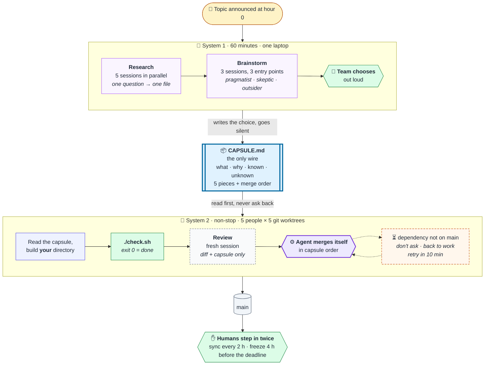

<div align="center">

# Multi-AI Hackathon Blueprint

**Two systems, one file between them.**

A playbook and a bootstrap kit for running a five-person team and ~20 AI coding-agent sessions
through a two-day hackathon whose topic nobody knows until hour zero.

[](#results)
[](https://github.com/TomaszGonczar/hackathon-multi-ai-blueprint/actions/workflows/ci.yml)
[](LICENSE)

</div>

> 🥉 **A five-person team ran this playbook at a two-day hackathon at TAURON Arena Kraków
> (3–4 October 2026) and placed 3rd.** I designed the workflow and wrote the playbook; the team
> built the solution.

## At a glance

- **The problem.** A topic announced at hour zero that nobody on the team knows well, five people,
  ~20 agent sessions and 48 hours including a night. The known failure modes: five different mental
  models of the problem, two people writing to the same place, "looks done" with nothing to prove
  it, and a loop that stalls at 3 a.m. waiting for a human.
- **The bet.** Tokens are cheap, so spend them. What is scarce is attention, the context of a single
  session, collisions and synthesis - the design protects those instead.
- **System 1** - one hour, one laptop - researches with five parallel sessions, brainstorms with
  three, and the team chooses one option out loud. The choice goes into one file: `CAPSULE.md`.
- **System 2** - non-stop, five people in five git worktrees. Every agent writes its test before its
  code, gets a review from a fresh session, and merges itself to `main` in the dependency order the
  capsule gives: it waits, it never asks. **Humans step in twice** - a sync every two hours and a
  freeze four hours before the deadline.

> *The machine can merge everything. It cannot say what you ship.*


```mermaid
flowchart TB
    TOPIC(["🎯 Topic announced at hour 0"]):::start

    subgraph S1["🔬 System 1 · 60 minutes · one laptop"]
        direction LR
        R["<b>Research</b><br/>5 sessions in parallel<br/><i>one question → one file</i>"]:::s1
        B["<b>Brainstorm</b><br/>3 sessions, 3 entry points<br/><i>pragmatist · skeptic · outsider</i>"]:::s1
        V{{"👥 <b>Team chooses</b><br/>out loud"}}:::human
        R --> B --> V
    end

    CAPS[["📦 <b>CAPSULE.md</b><br/>the only wire<br/>what · why · known · unknown<br/>5 pieces + merge order"]]:::capsule

    subgraph S2["🤖 System 2 · non-stop · 5 people × 5 git worktrees"]
        direction LR
        W["Read the capsule,<br/>build <b>your</b> directory"]:::s2
        C["<b>./check.sh</b><br/><i>exit 0 = done</i>"]:::gate
        RV["<b>Review</b><br/>fresh session<br/><i>diff + capsule only</i>"]:::opt
        M{{"⚙️ <b>Agent merges itself</b><br/>in capsule order"}}:::machine
        WAIT["⏳ dependency not on main<br/><i>don't ask · back to work<br/>retry in 10 min</i>"]:::wait
        W --> C --> RV --> M
        M -.-> WAIT -.-> M
    end

    MAIN[("main")]:::main
    H{{"✋ <b>Humans step in twice</b><br/>sync every 2 h · freeze 4 h before the deadline"}}:::human

    TOPIC --> S1
    S1 -->|"writes the choice, goes silent"| CAPS
    CAPS -->|"read first, never ask back"| S2
    S2 --> MAIN --> H

    classDef start fill:#fef3c7,stroke:#b45309,color:#1f2937
    classDef s1 fill:#faf5ff,stroke:#a855f7,color:#1f2937
    classDef s2 fill:#eef2ff,stroke:#4f46e5,color:#1f2937
    classDef human fill:#dcfce7,stroke:#15803d,color:#1f2937
    classDef capsule fill:#e0f2fe,stroke:#0369a1,stroke-width:3px,color:#1f2937
    classDef gate fill:#dcfce7,stroke:#15803d,color:#1f2937
    classDef machine fill:#ede9fe,stroke:#6d28d9,stroke-width:2px,color:#1f2937
    classDef wait fill:#fff7ed,stroke:#c2410c,stroke-dasharray:5 3,color:#1f2937
    classDef opt fill:#f9fafb,stroke:#6b7280,stroke-dasharray:4 3,color:#1f2937
    classDef main fill:#f1f5f9,stroke:#475569,color:#1f2937
```

## How it works

### 1. One file between the two systems

[`CAPSULE.md`](seed/templates/CAPSULE.md) is the only thing System 1 hands to System 2: what we
build, why this option and not the other two, what we know (each fact with a link), what we don't
know, the five pieces, and one command per piece that says "done". Its section 5 has a
**Waits for** column - the merge order, written so a machine can read it. It must not contain a
cycle: a cycle is a deadlock in which the agents wait forever. *A capsule that does not fit on one
A4 page is not a capsule.*

### 2. A state machine in `AGENTS.md`

Every agent session loads [`AGENTS.md`](seed/templates/AGENTS.md), and it has exactly one block
that changes:

```text
STATE:       BUILD
SINCE:       2026-10-03 13:00
NEXT:        SYNC at 15:00  ·  FREEZE 2026-10-04 12:00
NOTES:       w4 waits for w1 - w1 has not landed since 11:20
```

Nine states (`PREP` → `RESEARCH` → … → `SUBMIT` → `DONE`) and one table of what each state means
for the agent. Only System 1 (before the build) and a human (at sync and freeze) edit the block -
agents never. Eight rules apply in every state, and exactly one line is marked `IMPORTANT:`
(*do not end the session until `./check.sh` exits 0*), because highlighting everything highlights
nothing.

### 3. `check.sh` - exit 0 means done

Every piece has one [`check.sh`](seed/templates/check.sh.example) before its first line of code.
It exits 1 until it is filled in - a `PHASE` gate, so the test can exist before anyone knows what
to build - always scans staged changes for secrets, and must contain a step that proves the test
*catches something*. A green, worthless test is worse than none: it gives false calm.

### 4. Agents merge themselves - in order

After a green `check.sh` and a green review, the agent lands its own work on `main`, unless a
dependency listed in the capsule is not there yet. Then it does not ask; it goes back to work and
checks again in ten minutes:

```bash
git fetch origin main
for dep in 1 2; do
  git merge-base --is-ancestor origin/w$dep origin/main || echo "waiting for w$dep - back to work"
done
```

Every branch starts with a marker commit. Without it, every branch is already an ancestor of
`main`, the gate is vacuously true, and a dependent piece lands first - the seed's own end-to-end
test caught exactly that the night before the event. Mechanical conflicts the agent resolves
itself; a conflict in a file the capsule lists as an interface it records, leaves alone and
reports at sync.

The full rationale - every rule and the mistake it prevents - is in [`playbook/`](playbook/README.md).
Start with the briefing, then [`2-BUILD.md`](playbook/2-BUILD.md) for the merge loop.

## Design decisions

| Decision | Why | What it costs |
|---|---|---|
| **Research in one hour, not two** | building starts at T+1:00; five research files can be skimmed in ten minutes, ten cannot | a weaker grasp of the topic, so the capsule's "what we don't know" section carries more weight |
| **No memory between sessions** | the system lives 48 hours; a fresh session that reads the capsule thinks better than one dragging hours of chat | anything that must survive has to be written to a file |
| **Agents merge, humans step in twice** | the loop must not stall at 3 a.m. waiting for an approval | accountability sits at sync and freeze, not at every merge |
| **One worktree per person** | no shared surface means no collisions - not by rule, by construction | shared interface files must be named in the capsule up front |
| **Review in a fresh session** | the reviewer sees the diff and the capsule, not the reasoning behind them; "if it works, say so" stops invented findings | about two minutes per merge - the first thing to cut when time runs out |
| **No harness, bot or hooks** | the coding agent each person already uses is the runtime; nothing extra to keep alive overnight | rules are instructions, not enforcement - so the one rule the loop depends on is the only `IMPORTANT:` line |

## Try it in five minutes

Needs only `git` and `bash` - no accounts, and no network after the clone. `bootstrap.sh` writes
five worktrees into `$HOME`, so give it a throwaway one:

```bash
git clone https://github.com/TomaszGonczar/hackathon-multi-ai-blueprint
cd hackathon-multi-ai-blueprint
export SANDBOX="$(mktemp -d)"
HOME="$SANDBOX" bash seed/bootstrap.sh   # solution repo + five worktrees, idempotent
HOME="$SANDBOX" bash seed/verify.sh      # the ten checks from seed/VERIFY.md - what CI runs
ls "$SANDBOX"                            # hackathon-solution  w1-piece ... w5-piece
bash "$SANDBOX/w1-piece/check.sh"        # exits 1: phase 0, not filled in yet - by design
```

For the real thing, run `bash seed/bootstrap.sh` on every laptop the evening before and follow
[`seed/templates/START-HERE.md`](seed/templates/START-HERE.md).

## What's in the repository

| Path | What | For |
|---|---|---|
| [`playbook/`](playbook/README.md) | the method: the team briefing, System 1 (research), System 2 (build), the clock, the run sheet | humans, before and during the event |
| [`seed/`](seed/README.md) | `bootstrap.sh` (solution repo + five worktrees), `verify.sh` (ten checks), the templates | the team, the evening before |
| [`seed/templates/AGENTS.md`](seed/templates/AGENTS.md) | the agent contract: the state machine and the eight rules | every agent session |
| [`seed/templates/CAPSULE.md`](seed/templates/CAPSULE.md) | the hand-off template, six sections | System 1 → System 2 |
| [`docs/pre-event-review/`](docs/pre-event-review/README.md) | the method run on itself, the night before the event | reviewers |
| [`archive/`](archive/README.md) | v1 (3,391 lines, observer design) and its audit - frozen | history |

## How it evolved

Most of the work was cutting.

1. **v1 - a 3,391-line package (14–16 Sep).** Ten documents: architecture blueprint, development
   plan, a 77-item checklist, reuse ledger, failure and rehearsal plan, review record. A read-only
   observer role, human-only merges, a frozen "Mission Package". Several review rounds; nothing in
   it had been executed.
2. **The audit (end of Sep)** found a contradiction that the package's own review register listed
   as fixed - it was fixed in two places out of four - and judged the 77-item checklist impossible
   to execute on the day. → [`archive/AUDIT.md`](archive/AUDIT.md)
3. **v2 - two systems, one file (30 Sep).** The observer was replaced by fresh-context review, the
   Mission Package by `CAPSULE.md`, and "no AI merge, ever" by agents that merge in dependency
   order with two human checkpoints. Research went from two hours to one, and `AGENTS.md` became a
   state machine. About 1,200 lines - a third of v1.
4. **The method applied to itself (2 Oct).** A coding-agent session, briefed with one hand-off
   file, found ten defects that would have broken event morning, built the seed, and caught three
   more bugs by running it. → [`docs/pre-event-review/`](docs/pre-event-review/README.md)
5. **The event (3–4 Oct): 3rd place.**
6. **After:** the English translation, this layout, and CI that runs the seed and must catch three
   deliberate breakages. → [`CHANGELOG.md`](CHANGELOG.md)

## Results

**3rd place** - a five-person team, a topic announced at hour zero, two days at TAURON Arena
Kraków (3–4 October 2026).

What this does and does not show:

- **One event, one team.** The team placed 3rd; the playbook is how they organised the work, not
  what was judged.
- **Machine-checked:** the seed, the merge-order gate and `check.sh`. CI runs `bootstrap.sh` and
  all ten checks on every push, plus three deliberate breakages it has to catch.
- **Not machine-checked:** the human rules - sync, freeze, "say it immediately if the capsule is
  wrong". They have run at one event.

## Credits

- **Tomasz Gonczar** ([@TomaszGonczar](https://github.com/TomaszGonczar)) - designed the workflow
  and wrote the playbook.
- The seed and the pre-event review were produced by a coding-agent session working from
  [`HANDOFF.md`](docs/pre-event-review/HANDOFF.md) - the method applied to itself.
- The five-person team who ran it at the event and built the solution.
- Originally written in Polish; the English translation was merged on 5 October 2026.

**Sources the playbook builds on:** Anthropic,
[How we built our multi-agent research system](https://www.anthropic.com/engineering/multi-agent-research-system);
Anthropic, [Effective context engineering for AI agents](https://www.anthropic.com/engineering/effective-context-engineering-for-ai-agents);
[Claude Code best practices](https://code.claude.com/docs/en/best-practices);
and the 1979 IBM slide quoted by Simon Willison: *"A computer can never be held accountable."*

## License

[MIT](LICENSE) © 2026 Tomasz Gonczar
