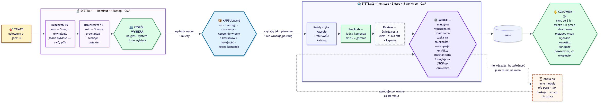

# Dwa systemy, jeden plik między nimi

Hackathon w sobotę. Temat nieznany do godziny zero. Pięć osób, ~20 sesji agentów,
dwa dni.

**To jest cały pomysł. Reszta pliku to jak go wykonać.**

Poprzednia wersja tego repo miała 3 391 linii i dwa systemy, które kosztowały więcej
niż dawały. Ta ma [pięć plików](#pliki) i zero mechanizmów, które trzeba utrzymywać.

---

## Zakład

Twój kumpel ma **2× Claude Pro i 1× ChatGPT**. Projekt jest zakładem, że **moc
obliczeniowa i tokeny w najlepszych modelach są do zdobycia i mają być wydane.**
Większość tego, co normalnie wygląda na rozsądne oszczędzanie, tutaj jest błędem.

Wiecej agentów, szersze równoległe ścieżki, dwa przeglądy zamiast jednego, pełne
przeszukiwanie tematu. Nikt nie powie „oszczędźmy sesję".

**Jedyne, co jest naprawdę wąskie, to nie tokeny:**

| Wąskie | Nie wąskie |
|---|---|
| **Uwaga** — kto czyta, kto decyduje | tokeny |
| **Kontekst jednej sesji** — im dłużej, tym gorszej myśli | liczba sesji |
| **Kolizje** — dwóch pisze w jedno miejsce | czas działania |
| **Synteza** — jeden lead czyta 10 wyników | research |

Cztery wąskie gardła. Wszystkie są w [`1-RESEARCH.md`](1-RESEARCH.md) i
[`2-BUDOWA.md`](2-BUDOWA.md).

---

## System 1 — research i brainstorm

**Jeden laptop. OMP. ~2 godziny. Nikt nie koduje.**

Bierze temat, rozbija go, researchuje równolegle, generuje **kilka podejść do
rozwiązania** i na końcu **zatrzymuje się**. Zespół wybiera. System 1 nie wybiera —
to jest jedyna rzecz, którą robi człowiek w tym systemie.

Wychodzi jeden plik: [`KAPSULA.md`](KAPSULA.md).

```
temat → [research: 6–10 sesji równolegle] → [brainstorm: 3 podejścia,
        każde od innego promptu] → lead składa → ZESPÓŁ WYBIERA → KAPSULA.md
```

## System 2 — budowa wybranego rozwiązania

**Pięć osób, pięć laptopów, pięć sesji OMP. Opcjonalnie pięć drugich do review.**

Każdy czyta `KAPSULA.md` jako pierwszą rzecz. Robi swój kawałek. Merge robi człowiek.

```
KAPSULA.md → 5 osób × 1-2 sesje → git worktree na osobę → merge przez człowieka
```

## Kapsuła — jedyny przewód między systemami

To jest cały handoff. Nie ma nic między.

```markdown
# KAPSULA.md

## 1. Co budujemy            ← zespół to wybrał, system 1 tylko przedstawił opcje
## 2. Dlaczego ta opcja      ← 3 zdania: dlaczego tak, a nie dwie pozostałe
## 3. Co wiemy               ← fakty, każdy z linkiem
## 4. Czego nie wiemy        ← ryzyka, świadomie zostawione
## 5. Pięć kawałków          ← kto, co, jaki katalog, jakie wejście/wyjście
## 6. Jak sprawdzamy          ← jedna komenda, exit 0 albo nie
```

Sześć bloków. `KAPSULA.md` w tym repo to **szablon — w sobotę nadpisujecie go
realnymi odpowiedziami.**

### Dlaczego kapsuła, a nie rozmowa

System 1 i system 2 dzieli jedno okno czasu i jedną brakującą rzecz: **wiedzę**.
Agent z systemu 1 nie ma okazji zapytać agenta z systemu 2, a człowiek nie jest
w stanie przekazać 40-stronicowego researchu ustami o 2:00 w nocy.

Dlatego jedyna rzecz, która **musi** przetrwać, to plik. I dlatego — patrz niżej —
nie potrzebujecie pamięci.

---

## Dwa dni = brak pamięci

System żyje 48 godzin. **Dlatego nie projektujemy pamięci.**

Wypada:

- architektura notatek, kompakcji, wznawiania sesji
- „co przeżywa między dniami"
- pamięć agenta, auto-memory, checkpointy
- cokolwiek, co zakłada, że wrócimy tu w grudniu

Zostaje jedna konsekwencja, i ona jest wygodna: **każda sesja startuje z czystym
kontekstem i to jest OK.** Sesja, która pamięta trzy godziny rozmowy, myśli gorzej
niż nowa. Nowa sesja czyta `KAPSULA.md` i ma wszystko.

Jedyny przewód to plik. Dlatego kapsuła musi być kompletna — nie dlatego, że jest
fajna, tylko dlatego, że **nie ma drugiego kanału.**

---

## Cztery reguły

Cała reszta plików to wykonanie tych czterech.

### 1. Jedna kapsuła, jeden wybór

System 1 przedstawia opcje. **Zespół wybiera na głos.** System 1 wpisuje wybór
do kapsuły i milczy. System 2 buduje wybrane i **nie wraca po poradę** — ma
wszystko w kapsule.

### 2. Jeden katalog na osobę

Pięć `git worktree`, zero wspólnych plików. Kolizja nie jest zbanowana — **nie ma
jej**, bo nie ma powierzchni, o którą można się podzielić. Reguła, którą trzeba
było pilnować 19 punktami checklisty, jest strukturą katalogu.

### 3. Jeden test na kawałek

Jedna komenda. Exit 0 = gotowe. **Bez niej agent nie wie, kiedy skończył, a wy nie
wie, czy działa.** To jedyna rzecz, bez której reszta nie działa — i jest darmowa.

### 4. Merge robi człowiek

Nie „bo AI nie powinno". Slajd IBM-a z 1979, który cytuje Simon Willison:
*„A computer can never be held accountable. Therefore a computer must never make a
management decision."* Merge jest decyzją zarządczą.

Plus **wariant awaryjny nazwany w piątek** — nie „ktoś, kto akurat może".

---

## Opcjonalne — i pierwsze do odcięcia

Zakład mówi, że mamy dużo mocy. Ale mocy trzeba **użyć w jednym miejscu dobrze**,
nie rozsypać wszędzie.

| Mechanizm | Koszt | Co daje | Jeśli zabraknie czasu |
|---|---|---|---|
| **Drugi agent na review** | ~2 min na kawałek | świeży kontekst, nie widzi rozumowania autora | tnij pierwszy |
| **Trzeci agent „złośliwy"** na review | ~2 min | łapie to, czego dwaj inni nie zauważyli | tnij pierwszy |
| **Pełne wyszukiwanie tematu** (6–10 sesji) | godzina z hoss | szerokość, której jeden agent nie da | tnij do 3 sesji |

Ostatnia z tych trzech jest jedyną, której **nie** tnęlibyśmy — bo research jest
jedynym miejscem, gdzie wiele agentów naprawdę wygrywa.

---

## Pliki

| Plik | Co | Linie |
|---|---|---|
| [`1-RESEARCH.md`](1-RESEARCH.md) | System 1: rozbicie tematu, ile sesji, brainstorm, kiedy się zatrzymać | 163 |
| [`KAPSULA.md`](KAPSULA.md) | Szablon. W sobotę nadpisujecie go odpowiedziami. | 99 |
| [`2-BUDOWA.md`](2-BUDOWA.md) | System 2: pięć sesji, test, worktree, review, merge | 205 |
| [`3-PIESC.md`](3-PIESC.md) | Zegar. Piątek 30 min, sobota godzina po godzinie. | 146 |

Razem **811 linii** zamiast 3 391 — 24% objętości. A w środku jest wszystko, czego
potrzebuję, łącznie z szablonem, który w sobotę nadpisujecie.




Pliki `00_`–`09_`, `render/` i `HISTORY.md` to **poprzedni pakiet** — ten sam, który
był w `main`. Zostawiam je w tym branchu, bo [`archiwum/AUDYT.md`](archiwum/AUDYT.md)
się do nich odwołuje i bo są twoją pracą, nie moją. Nie czyta się ich w sobotę.

[`archiwum/`](archiwum/README.md) — wcześniejsze wersje tego materiału i audyt
oryginalnego pakietu. **Nieoperacyjne.** Czytamy tylko jeśli ktoś pyta, skąd to się wzięło.

---

## Co jest tu zbyteczne i dlaczego nie ma tego

Żeby nie wrócić do 3 391 linii:

| Nie ma | Dlaczego |
|---|---|
| checklisty | 5 osób w nocy nie odhacza 77 punktów. Ma trzy komendy i zegar. |
| rejestru ryzyk, premortemów | na co dzień to zapis, na potem opowieść. |
| schematów wielu | jeden, prosty. |
| statusów walidacji | zastąpiła je jedna zasada: **twierdzenie bez komendy nie istnieje.** |
| zarządzania pamięcią | 2 dni. Nie ma czego zarządzać. |
| budowania własnego harnessa | OMP już jest. |
| osobnych „osób" i „ról" | pięć osób i dwa nazwiska. Reszta to funkcja przy okazji. |

Ostatnie dwa to najważniejsze: **budujemy na OMP i nie wchodzimy o poziom wyżej.**
Żadnego meta-harnessa, żadnej własnej orkiestracji, żadnych hooków i konfiguracji.
OMP to runtime. My piszemy dwa pliki i klikamy merge.

---

## Jedno zdanie

> **System 1 bada i podsuwa opcje, zespół wybiera, system 1 zapisuje wybór w jednym
> pliku, pięć osób buduje z tego pliku w swoich katalogach, jeden człowiek merguje.**

Wszystko inne to sposoby na zrobienie tego samego trudniej.
