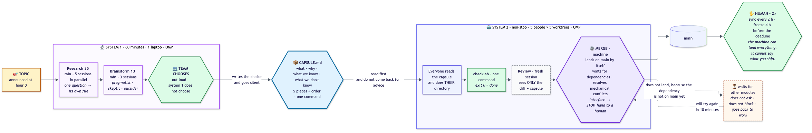

# Two systems, one file between them

> **Context.** This is the team briefing as written on 2 October 2026, the evening before the
> event; "Saturday" is the first day of the hackathon. *OMP* is the terminal coding agent the
> playbook was written against - any coding agent (Claude Code, Codex, ...) works the same way.
> The overview for outside readers is the [root README](../README.md); what changed since the
> event is in the [changelog](../CHANGELOG.md).

Hackathon on Saturday. Topic unknown until hour zero. Five people, ~20 agent sessions,
two days. **System 2 runs non-stop.**

**That is the whole idea. The rest of the file is how to carry it out.**

The previous version of this repo had 3,391 lines and two systems that cost more
than they gave. This one has [five files](#files---two-groups-two-audiences) and zero mechanisms you have to maintain.

---

## The bet

The team had **2× Claude Pro and 1× ChatGPT**. The project is a bet that **compute
and tokens in the best models are obtainable and are meant to be spent.**
Most of what normally looks like sensible saving is a mistake here.

**The only things that are truly narrow are not tokens:**

| Narrow | Not narrow |
|---|---|
| **Attention** - who reads, who decides | tokens |
| **One session's context** - the longer, the worse it thinks | number of sessions |
| **Collisions** - two people writing to one place | running time |
| **Synthesis** - one lead reads 10 results | research |

---

## System 1 - research and brainstorm. **One hour.**

**One laptop. OMP. 60 minutes. Nobody codes.**

```
0:00 ─ 0:35  research: 5 sessions in parallel, each writes to its own file
0:35 ─ 0:48  brainstorm: 3 sessions, 3 different entry points → 3 proposals
0:48 ─ 0:58  TEAM CHOOSES an option out loud → system 1 writes it into the capsule
0:58 ─ 1:00  brief read out loud
              ▼
          CAPSULE.md
```

One hour instead of two. Five sessions instead of six to ten. The consequence is
simple and worth knowing: **understanding of the topic is weaker.** If the topic turns
out harder than you thought, you will see it at hour 3, not at 1.5. That is why
section 4 of the capsule ("what we don't know") matters more than it used to - and it is filled in
by system 1, not by you.

The rest of the team **does not wait** during this hour - they build their `check.sh`
files, described in `2-BUILD.md`.

## The capsule - the only wire

```markdown
# CAPSULE.md

## 1. What we are building       ← the team chose, system 1 only suggested options
## 2. Why this option            ← 3 sentences + why the others were rejected
## 3. What we know               ← facts, each with a link
## 4. What we don't know         ← risks, knowingly left in
## 5. Five pieces                ← who, what, which directory, waits for whom   ← KEY
## 6. How we check               ← one command, exit 0 or not
```

Section 5 now has a **"Waits for"** column and that is not cosmetic - **it is the
merge order, machine-readable.** Without it the machine does not know what can land on `main`
before the others, and it stops at a question to a human. See
[`2-BUILD.md`](2-BUILD.md).

### Why a capsule and not a conversation

System 1 and system 2 share one window of time and one missing thing: **knowledge**.
An agent from system 1 will not ask an agent from system 2, and a human will not pass on the research
by mouth at 2:00 at night.

So the only thing that **must** survive is a file. And that is why - see below -
you do not need memory.

## Two days = no memory

The system lives 48 hours. **So we do not design memory.**

Out: note architecture, compaction, session resumption, agent memory,
checkpoints, "what survives between days". None of it makes sense when tomorrow
we start from scratch.

The consequence is convenient: **every session starts with a clean context and that is OK.**
A session that remembers three hours of conversation thinks worse than a new one. A new one reads the
capsule and has everything.

---

## System 2 - build, non-stop

**Five people, five laptops, five OMP sessions. Optionally more for review.**

**The machine merges on its own.** Every agent, after a green `check.sh`, tries to land on
`main`. If its dependencies are not yet on `main` - **it waits and goes back to work.**
It does not ask. It does not block the team.

```
CAPSULE.md → 5 people × 1-2 sessions → worktree per person → green test → MACHINE MERGES
                                                                            │
                                            waits for other modules ◄───────┤
                                                                            ▼
                                                          human: sync every 2 h and freeze
```

### One sentence to say out loud before the start

> **The machine can merge everything. It cannot say what you ship.**

That is why the human steps in **twice**: at sync (every 2 h) and at freeze. Everything
in between is machine. If that is settled, it is a compromise - the human
is responsible for the result, the machine executes. The IBM slide from 1979, quoted by Simon Willison,
does not change just because the merge is automatic: *"A computer can never be held
accountable."* The only question is **where** the human steps in - and the answer is:
where it is decided what matters, not where code gets moved.

---

## Four rules

### 1. One capsule, one choice

System 1 will suggest options. **The team chooses out loud.** System 1 writes the choice into the
capsule and goes silent. System 2 builds the chosen one and **does not come back for advice**.

### 2. One directory per person, merge order in the capsule

Five `git worktree`s, zero shared files - there are no collisions because there is no surface.
The order of landing on `main` is described by the table in section 5 of the capsule, column "Waits for".

### 3. One test per piece

One command. Exit 0 = done. **Without it the agent does not know when it has finished.**
It is the one thing without which the rest does not work - and it is free.

### 4. The machine merges, the human steps in twice

Green test → review in a fresh context → merge. Waits for dependencies, does not ask.
Mechanical conflict it resolves itself. **Conflict in an interface file → writes it down,
does not touch it, goes back to work, reports at sync.**

---

## Optional - and first to cut

| Mechanism | Cost | What it gives | If time runs out |
|---|---|---|---|
| **Second agent for review** | ~2 min | fresh context, does not see the author's reasoning | cut first |
| **Third "malicious" agent** | ~2 min | catches what the other two will not notice | cut first |
| **Mechanical conflict resolution** | 0 | the machine does it itself | keep, because without it the loop stops |

The last one is the only one of the three we would **not** cut. The rest of system 2
assumes the machine lands without asking.

---

## State drives the workflow - [`AGENTS.md`](../seed/templates/AGENTS.md)

The whole system has **one file the agent always reads**, and in it there is **one block
that changes**:

```text
STATE:       BUILD
SINCE:       2026-10-03 13:00
NEXT:        SYNC at 15:00  ·  FREEZE 2026-10-04 12:00
NOTES:       w4 waits for w1 - w1 has not landed since 11:20
```

The rest of the file - the rules - is **derived** from this, not separate. Nine states
(`PREP` → `RESEARCH` → `BRAINSTORM` → `CHOICE` → `BUILD` → `SYNC` →
`FREEZE` → `SUBMIT` → `DONE`) and a "what follows from it" table. Changing one line
moves the whole system to a different behavior.

This is the answer to the question *"what happens at 3:00 at night, when nobody
is watching"* - the answer is not an instruction, but **reading the state**. A session starts,
reads `STATE: BUILD`, and knows what to do.

### Why it has to be one file and not a separate instruction per phase

There are nine states × five pieces = forty-five variants of instructions in the repo.
**Nobody will read or update that.** One state pointer
plus a table gives exactly the same power in 190 lines.

### The rule that keeps this file small

From the Claude Code documentation, verbatim:

> *"Bloated CLAUDE.md files cause Claude to ignore your actual instructions!"*
> *"For each line, ask: Would removing this cause Claude to make mistakes? If not,
> cut it."*

Hence §8 in `AGENTS.md`: **a line that does not prevent a mistake goes in the bin.**
And a second, more important one: **a line that is ignored despite being present also goes in
the bin** - you move it to where it is enforced mechanically.

One line in the whole file is highlighted with `IMPORTANT:`. The rule from the documentation:
if the agent skips an instruction, highlight **that one**, not all of them. For us
it is *"do not finish until `check.sh` exits 0"* - because it is the only one the whole loop
hangs on.

### Who edits the state

Until T+1:00 - **system-1**. After that - **the human, at sync and at freeze**.
**Building agents never.** One file, one author at a time - the same as
five directories.

### Where this file lives on Saturday

In the **root directory of the solution repo**, not here. [`seed/bootstrap.sh`](../seed/README.md)
copies `AGENTS.md` and `CAPSULE.md` from `seed/templates/` into your repo, because that is where
the agent loads them from.

---

## Files - two groups, two audiences

**For agents.** Loaded automatically at the start of every session. The agent reads
nothing else until this file says it should.

| File | What |
|---|---|
| [`AGENTS.md`](../seed/templates/AGENTS.md) | **context and situation.** System state + rules that follow from that state |
| [`CAPSULE.md`](../seed/templates/CAPSULE.md) | Handoff template. On Saturday you overwrite it with your answers. |

Both are templates in [`seed/templates/`](../seed/README.md); the seed copies them into the
solution repo.

**For humans.** Read in your own words, when you need to understand *why*.

| File | What |
|---|---|
| [`1-RESEARCH.md`](1-RESEARCH.md) | System 1: topic breakdown, 5 sessions in 60 minutes, brainstorm, choice |
| [`2-BUILD.md`](2-BUILD.md) | System 2: five sessions, test, machine merge, waiting for modules |
| [`3-CHEATSHEET.md`](3-CHEATSHEET.md) | The clock. Friday 30 min, Saturday hour by hour. |

Added the evening before by the [pre-event review](../docs/pre-event-review/README.md):
[`DEVPLAN.md`](DEVPLAN.md), the run sheet from Friday evening to submission, every step with an
owner and a visible pass condition.



The line that does not change through this whole refactor: **the eight rules from `AGENTS.md`
§4 are the entire operating system.** Everything else is justification for why they are
the way they are and not otherwise.

`00_`-`09_`, `06_ARCHITECTURE.mmd`, `render/` and `HISTORY.md` live in
[`archive/old-package/`](../archive/old-package/README.md) - **the previous package**, the
same one that was in `main`. Not deleted (evidence), but taken off the root directory so that
they do not get mixed up with what is operational. You do not read them on Saturday.

[`archive/`](../archive/README.md) - earlier versions of this material, the previous
package and the audit of the original. **Non-operational.**

---

## What is not here and why

| Not here | Why |
|---|---|
| **A merge harness** | merge is a rule in the agent loop, not a separate program. No orchestration. |
| checklists | 5 people at night do not tick off 77 items. They have three commands and a clock. |
| risk registers, premortems | day to day a record, later a story. |
| validation statuses | replaced by one principle: **a claim without a command does not exist.** |
| memory management | 2 days. There is nothing to manage. |
| building anything alongside OMP | the coding agent (OMP / Claude Code / Codex) is the runtime. We write files and click sync. |
| separate "personas" and "roles" | five people and two names. The rest is a function on the side. |

---

## One sentence

> **System 1 researches for an hour and suggests three options, you choose out loud, system 1
> writes the choice in one file, five machines build from it in their directories
> and let themselves onto `main` while waiting for modules, and you step in twice - at sync
> and at freeze.**
